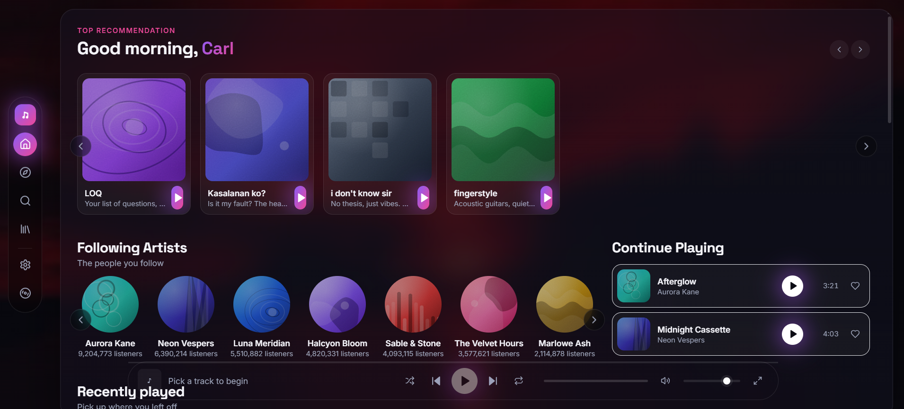

# Nocturne

> A premium, cinematic music player — **not** a Spotify clone. Glassmorphic UI, a real Web Audio synthesis engine, and deterministic generated artwork. No external assets, no APIs, fully offline.


<p align="center">
  
</p>

<p align="center">
  <a href="#run"><strong>Try it locally</strong></a> ·
  <a href="https://github.com/CarlAyeng/nocturne/issues"><strong>Report a bug</strong></a> ·
  <a href="https://github.com/CarlAyeng/nocturne/blob/main/LICENSE"><strong>License</strong></a>
</p>

---

## What's inside

- **Real playback** — a procedural Web Audio synth engine (per-track voicing, slow LFO + tremolo movement) with a virtual transport clock for accurate seek/next/prev. The engine auto-switches to HTML5 audio if you drop a real MP3 in `/public/audio/` and set `audioUrl` in `src/data/tracks.ts`.
- **Single-glass layout** — one floating glass card over a full-bleed photo background (`/public/bg.jpg`), with a vertical icon rail on the left and a compact floating player pill at the bottom.
- **Generated album artwork** — every cover is a deterministic SVG (gradient + abstract shape + grain + monogram) built from `(seed, shape, palette)`. The dynamic Now Playing background reuses the current track's palette.
- **Featured personal playlists** — four curated mood playlists on the front page: **LOQ** (eclectic), **Kasalanan ko?** (regretful), **i don't know sir** (mellow), and **fingerstyle** (acoustic).
- **Local persistence** — liked songs, playlists, followed artists, recently played, and recent searches are all stored in `localStorage`.
- **Search** with **recent searches** (last 8, persisted), **live suggestions**, and full relevance scoring across tracks / artists / albums / playlists.
- **Library** — Spotify-style "Your Library" with Playlists / Artists / Albums filter pills, search-in-library, and a Create flow.
- **Drag-to-reorder queue** — HTML5 drag-and-drop plus a keyboard alternative (focus the handle, press ↑/↓).
- **Long-title marquee** — overflowing titles scroll seamlessly (pauses on hover, disabled under reduced motion).
- **Keyboard shortcuts** — Space (play/pause), ←/→ (seek ±5s), N / P (next / prev), L (like), F (now playing), Ctrl/⌘+K (focus search).
- **Accessibility** — visible focus rings, full keyboard navigation, ARIA labels, `prefers-reduced-motion` honored.

### Feature highlights

| | |
|---|---|
| 🪟 **Single glass card** | One floating `backdrop-filter: blur(24px)` card over your photo background. The whole app reads as one object. |
| 🎚 **Procedural audio engine** | Per-track Web Audio synth with a virtual transport clock — real play/pause/seek/next/prev, no synth hackery required. |
| 🎨 **Deterministic artwork** | Every cover is built at runtime from `(seed, shape, palette)` — same inputs always produce the same SVG. No images stored. |
| 🧪 **Real interactivity** | Drag-to-reorder queue, long-title marquee, keyboard shortcuts, full ARIA, reduced-motion respected. |
| 📦 **Zero API dependencies** | 100% offline-capable. Drop in your own MP3s to upgrade from synth to real audio. |

## Stack

- **React 18 + TypeScript 5 + Vite 5** — fast dev, fast build
- **Tailwind CSS 3** — design tokens (violet→magenta brand, dark cinematic palette)
- **React Router 6** — lazy-loaded route splitting (`/`, `/discover`, `/search`, `/library`, `/playlist/:id`, `/album/:id`, `/artist/:id`)
- **Framer Motion 11** — spring transitions, layout animations, reduced-motion gated
- **Lucide React** — vector icons
- **Web Audio API** — synthesis + analyser, with an `audioUrl` upgrade path to real MP3s

## Run

```bash
npm install
npm run dev          # Vite dev server at http://localhost:5173
npm run build        # tsc -b && vite build → dist/
npm run preview      # serve the production build
npm run typecheck    # tsc --noEmit
```

### Custom background photo

The page background loads `/public/bg.jpg`. Drop any 1920×1080+ JPG or PNG at that path; the layout dims and blurs it automatically. Without the file, the page falls back to a dark canvas.

### Real audio files

Drop royalty-free MP3s into `/public/audio/`, then point a track at it in `src/data/tracks.ts`:

```ts
{ id: 't-mid1', title: 'Midnight Cassette', audioUrl: '/audio/midnight.mp3', /* ... */ }
```

The engine swaps synth → HTML5 audio automatically (`MediaElementSourceNode` → same analyser → visualizer).

## Project structure

```
src/
├─ audio/         # AudioEngine (synth + audio-element modes)
├─ components/
│  ├─ common/     # Button, Input, Menu, Slider, Toaster, ...
│  ├─ layout/     # AppShell, IconRail (Sidebar/TopBar kept for reference)
│  ├─ media/      # CoverArt, Marquee, AlbumCard, PlaylistCard, ...
│  └─ player/     # MusicPlayer, NowPlaying, ProgressBar, QueuePanel
├─ context/       # PlayerContext, LibraryContext, UIContext
├─ data/          # artists, albums, tracks, playlists, lyrics
├─ hooks/         # useLocalStorage, useMediaQuery
├─ pages/         # Home, Discover, Browse, Search, Library, PlaylistDetail, AlbumDetail, Artist
├─ types/         # domain types (Track, Album, Artist, Playlist, ResolvedTrack, ...)
└─ utils/         # cn, palette, search, format, cover, seededRandom
public/
├─ bg.jpg         # page background (replace with your own)
└─ audio/         # optional real MP3s
```

## Design tokens

| Token | Value | Where |
|---|---|---|
| Canvas | `#0B0B14` | page fallback + dark surfaces |
| Primary | `#8B5CF6` | accents, gradients |
| Accent | `#EC4899` | hover, play state, heart |
| Glow | `#A855F7` | shadows, button glow |
| Display font | Space Grotesk | headings, brand |
| Body font | Inter | everything else |
| Glass | `rgba(18,18,30,0.6)` + `blur(24px) saturate(140%)` | page card |

## License & content notice

This is a portfolio project. All artist names, album titles, and track titles are original/fictional — no real or copyrighted material is used. The audio is procedurally synthesized at runtime; replace with licensed tracks before any public distribution.
